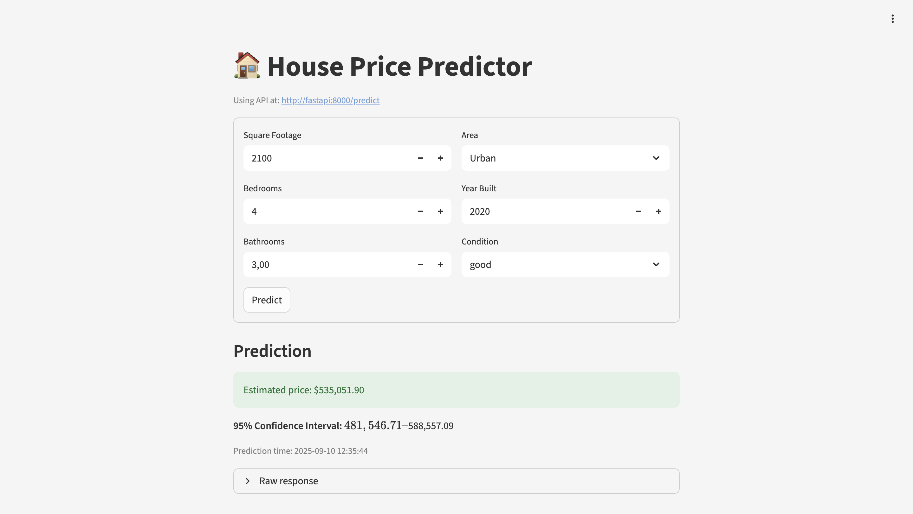

# 🏠 House Price Predictor – An End-to-End ML Pipeline

The House Price Predictor is a complete machine learning project that demonstrates how to take a real-world problem from raw data all the way to production-ready deployment.

This project covers the entire ML lifecycle, including:

 - Data ingestion & preprocessing – cleaning and preparing raw housing datasets.

 - Feature engineering – extracting domain-relevant features to improve predictive performance.

 - Model development & experimentation – training multiple models, tuning hyperparameters, and tracking experiments with MLflow.

 - Experiment tracking & model registry – logging runs, metrics, and artifacts in a central MLflow server.

 - Deployment – serving predictions through a FastAPI service and a Streamlit web UI.

 - MLOps best practices – environment reproducibility, Dockerized services, CI/CD-friendly structure, and modular code organization.

The goal is to predict house prices given property features such as square footage, number of bedrooms/bathrooms, location, year built, and condition. The project simulates how an ML workflow would look in an industry setting — from raw CSV data to an interactive web application.

---

## 📦 Project Structure

```
house-price-predictor/
├── configs/ # YAML-based configuration for models
│ └── model_config.yaml
│
├── data/
│ ├── raw/ # Raw datasets
│ └── processed/ # Processed/cleaned datasets
│
├── deployment/
│ └── mlflow/ # Docker Compose setup for MLflow
│
├── mlruns/ # MLflow experiment tracking runs
│
├── models/
│ └── trained/ # Trained models and preprocessors
│ ├── house_price_model.pkl
│ └── preprocessor.pkl
│
├── notebooks/ # Jupyter notebooks for exploration
│ ├── 00_data_engineering.ipynb
│ ├── 01_exploratory_data_analysis.ipynb
│ ├── 02_feature_engineering.ipynb
│ └── 03_experimentation.ipynb
│
├── src/
│ ├── api/ # FastAPI inference service
│ │ ├── inference.py
│ │ ├── main.py
│ │ ├── schemas.py
│ │ ├── utils.py
│ │ └── requirements.txt
│ │
│ ├── data/ # Data processing scripts
│ │ └── run_processing.py
│ │
│ ├── features/ # Feature engineering pipeline
│ │ └── engineer.py
│ │
│ └── models/ # Model training & evaluation
│ └── train_model.py
│
├── streamlit_app/ # Streamlit web application
│ ├── app.py
│ ├── config.toml
│ ├── Dockerfile
│ ├── requirements.txt
│ └── .streamlit/
│
├── Dockerfile # FastAPI service Dockerfile
├── docker-compose.yaml # Compose file to run API + Streamlit
├── mlflow.db # SQLite backend for MLflow
├── requirements.txt # Python dependencies
└── README.md # Project documentation
```

---

##  Setting up Learning/Development Environment

To begin, ensure the following tools are installed on your system:

- [Python 3.11](https://www.python.org/downloads/)
- [Git](https://git-scm.com/)
- [Visual Studio Code](https://code.visualstudio.com/) or your preferred editor
- [UV – Python package and environment manager](https://github.com/astral-sh/uv)
- [Docker Desktop](https://www.docker.com/products/docker-desktop/) 
---

##  Preparing Your Environment

1. **Clone your forked copy:**

   ```bash
   # Replace xxxxxx with your GitHub username or org
   git clone https://github.com/georgeTs19/house-price-predictor.git
   cd house-price-predictor
   ```

2. **Setup Python Virtual Environment using UV:**

   ```bash
   uv venv --python python3.11
   source .venv/bin/activate
   ```

3. **Install dependencies:**

   ```bash
   uv pip install -r requirements.txt
   ```

---

##  Setup MLflow for Experiment Tracking

To track experiments and model runs:

```bash
cd deployment/mlflow
docker compose -f docker-compose.yaml up -d
docker compose ps
```

Access the MLflow UI at [http://localhost:5555](http://localhost:5555)

---

##  Using the Notebooks 

After setting up MLflow for experiment tracking, you can explore the Jupyter notebooks to perform **EDA (Exploratory Data Analysis)**, engineer features, and experiment with different models to identify the best-performing one.

---

## Model Workflow

###  Step 1: Data Processing

Clean and preprocess the raw housing dataset:

```bash
python src/data/run_processing.py   --input data/raw/house_data.csv   --output data/processed/cleaned_house_data.csv
```

---

###  Step 2: Feature Engineering

Apply transformations and generate features:

```bash
python src/features/engineer.py   --input data/processed/cleaned_house_data.csv   --output data/processed/featured_house_data.csv   --preprocessor models/trained/preprocessor.pkl
```

---

###  Step 3: Modeling & Experimentation

Train your model and log everything to MLflow:

```bash
python src/models/train_model.py   --config configs/model_config.yaml   --data data/processed/featured_house_data.csv   --models-dir models   --mlflow-tracking-uri http://localhost:5555
```

---


## Building FastAPI and Streamlit 

Both the FastAPI service (in src/api) and the Streamlit app (in streamlit_app) are already Dockerized and ready to use.
You can launch them together using Docker Compose:
```bash
docker compose up --build
```
- The FastAPI service will be available at: http://localhost:8000/docs
- The Streamlit app will be available at: http://localhost:8501

The docker-compose.yaml file already sets up the necessary environment variables, including:
```bash
environment:
  - API_URL=http://fastapi:8000
```
This allows the Streamlit app to communicate with the FastAPI service for predictions.

Once you have launched both the apps, you should be able to access streamlit web ui and make predictions. 

You could also test predictions with FastAPI directly using 

```bash
curl -X POST "http://localhost:8000/predict" \
-H "Content-Type: application/json" \
-d '{
  "sqft": 1500,
  "bedrooms": 3,
  "bathrooms": 2,
  "location": "suburban",
  "year_built": 2000,
  "condition": fair
}'

```

Be sure to replace `http://localhost:8000/predict` with actual endpoint based on where its running. 

## 🖼️ App Preview

The Streamlit UI provides a simple form to enter property features (square footage, bedrooms, bathrooms, area, year built, condition) and returns a real-time price estimate from the FastAPI service.

- Shows the API endpoint in use for transparency.
- Validates inputs and posts a JSON payload to `/predict`.
- Displays:
  - **Estimated price**
  - **95% confidence interval**
  - **Prediction time**
  - Optional **feature importance** chart (if returned)
  - A collapsible **raw response** for debugging




##  Future Enhancements

This project already demonstrates a full end-to-end ML workflow, but there are several directions it can be extended:

- **Data Improvements**
  - Integrate larger and more diverse housing datasets (multiple cities, countries).
  - Add external features such as interest rates, school ratings, crime index, or walkability scores..

- **MLOps & Deployment**
  - Automate CI/CD with GitHub Actions or GitLab CI for model retraining and deployment.
  - Deploy services on cloud platforms (AWS, GCP, Azure).

- **API & UI Improvements**
  - Extend the FastAPI service with a `/batch-predict` endpoint (already stubbed in).
  - Add authentication and request logging.
  - Improve the Streamlit UI with richer visualizations and comparison of multiple predictions.

- **Monitoring & Maintenance**
  - Integrate MLflow Model Registry for managing model versions in production.
  - Add model monitoring (data drift, prediction drift, accuracy tracking).
  - Alerting pipelines when performance degrades.

